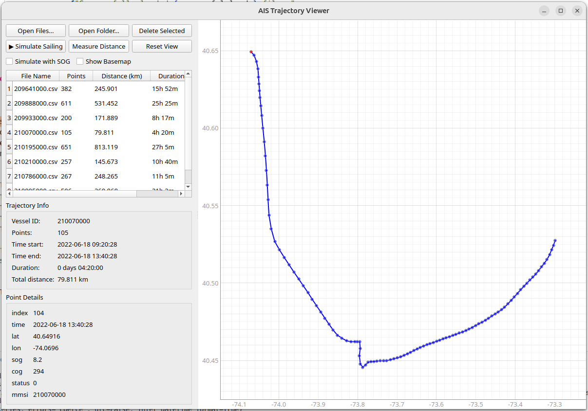

# AIS Trajectory Viewer  
*A lightweight, interactive desktop tool for visualising Automatic Identification System (AIS) vessel tracks.By default, the app treat one csv file as one trajectory.*
<div align="center">

</div>
---

## ✨ Features

| Feature | Description |
|---------|-------------|
| 📂 **Batch Import** | Load single CSV files or entire folders at once. |
| 🗺️ **Basemap Overlay** | Toggle OpenStreetMap tiles for geographic context. |
| 🎮 **Sailing Simulation** | Replay any trajectory in real time (constant or SOG-based speed). |
| 📏 **Distance Measure** | Click-to-measure great-circle distances on the plot. |
| 🖱️ **Hover Tooltip** | Instant data read-out when hovering over any point. |
| 📊 **Sortable Table** | 4-column view with **file name, point count, distance, duration**; all columns numerically sortable. |
| 🎨 **Multi-Trajectory** | Overlay unlimited tracks, each in its own colour with legend. |
| 🛡️ **Robust Parser** | Auto-detects common column names (`lat`, `lon`, `time`, `sog`, `cog`, `mmsi`, …). |
| 🖥️ **Cross-Platform** | Pure Python 3 + PyQt5; runs on Windows, macOS, Linux. |

---

## 🚀 Quick Start

### 1. Install Dependencies
```bash
pip install -r requirements.txt
```

`requirements.txt`
```
PyQt5
pyqtgraph
pandas
numpy
Pillow
requests
```

### 2. Run
```bash
python ais_viewer.py
```

### 3. Load Data
* **Files**: `File ▸ Open Files…`  
* **Folder**: `File ▸ Open Folder…`

Drag-selection or <kbd>Ctrl</kbd>-click to choose multiple trajectories.

---

## 📁 Data Format

The viewer accepts **CSV files** with at least:

| Canonical | Typical Column Names |
|-----------|----------------------|
| `time`    | `timestamp`, `datetime`, `BaseDateTime`, … |
| `lat`     | `latitude`, `y`, … |
| `lon`     | `longitude`, `x`, … |

Optional columns (`sog`, `cog`, `mmsi`, `status`) are used for simulation and display.

> The parser is **case-insensitive** and ignores special characters, so `LATITUDE`, `Lat`, or `lat` all map to `lat`.

---

## 🎮 Using the Viewer

| Action | How |
|--------|-----|
| **Zoom** | Mouse wheel or `Reset View` button. |
| **Pan** | Click & drag. |
| **Measure** | Enable “Measure Distance”, click start & end points. |
| **Replay** | Select one trajectory, press `▶ Simulate Sailing`. Toggle `Simulate with SOG` for realistic timing. |
| **Basemap** | Tick “Show Basemap” to overlay OSM tiles. |
| **Delete** | Select rows ➜ `Delete Selected`. |

---

## 🧪 Simulation Modes

| Mode | Behaviour |
|------|-----------|
| **Constant** | Fixed 70× speed-up. |
| **SOG-based** | (Checkbox on) Uses actual `sog` (knots) to calculate realistic elapsed time between fixes. |

---

## 🔧 Development Tips

* **High-DPI**: Already enabled; set `QT_XCB_GL_INTEGRATION=none` if you encounter OpenGL issues on Linux.
* **Custom Colours**: Edit the `colors` list in `on_select_file()` to change multi-trajectory palette.
* **Tile Cache**: Currently no on-disk caching; tiles are re-fetched each session.

---

## 🐛 Troubleshooting

| Problem | Fix |
|---------|-----|
| `ImportError: PyQt5` | `pip install PyQt5` |
| Blank window / no map tiles | Check internet connectivity; OSM servers may block excessive requests. |
| Simulation too fast/slow | Adjust `simulation_speed_multiplier` in code. |

---

## 📄 License

MIT – do what you like, attribution welcome.

---

Happy sailing! 🚢
